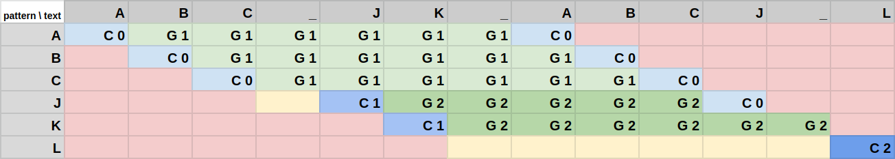

# _Powierża coefficient_

_Powierża coefficient_ is a statistic on strings for gauging whether a string is an "abbreviation" of another. The function is not symmetric so it is not a metric.

- Let `T` (text) be a non-empty string.
- Let `P` (pattern) be a non-empty subsequence of `T`.
- Let `p` be a partition of `P` and `p_i` be its elements, where:
  - every `p_i` is equal to some substring of `T`, `t_i`.
  - the substrings `t_i` do not overlap.
  - `t_i` are in the same order as `p_i`.

**_Powierża coefficient_ is the number of elements of the shortest partition `p`, less one. Alternatively, it is the number of gaps between the substrings `t_i`.**

Used terms:

- A substring is a subsequence made of consecutive elements only. A subsequence doesn't have to be a substring. For example, `xz` is a subsequence of `xyz` but it is not its substring.
- A partition of a sequence is a sequence of pairwise disjoint subsequences that, when concatenated, are equal to the entire original sequence.

## Intuitive explanation

Take all characters from the pattern and, while perserving the original order, align them with the same characters in the text so that there are as few groups of characters as possible. The coefficient is the number of gaps between these groups.

## Examples

| `P`        | `T`                    | `p`            | _Powierża coefficient_ |
| ---------- | ---------------------- | -------------- | ---------------------- |
| `powcoeff` | `powierża coefficient` | `pow`, `coeff` | 1                      |
| `abc`      | `a_b_c`                | `a`, `b`, `c`  | 2                      |
| `abc`      | `abc`                  | `abc`          | 0                      |
| `abc`      | `xyz`                  | —              | not defined            |

For more examples, see [tests](https://github.com/micouy/powierza-coefficient/blob/c9d77db4df0b00bdb4983f080e0a0e7bc47a0de0/src/lib.rs#L121-L133).

## Use case

The _Powierża coefficient_ is used in [`kn`](https://github.com/micouy/kn) and in [`nushell`](https://github.com/nushell/nushell) to determine which of the directories' names better match the abbreviation. Many other string coefficients and metrics were found unsuitable, including _Levenshtein distance_. _Levenshtein distance_ is biased in favour of short strings. For example, the _Levenshtein distance_ from `gra` to `programming` is greater than to `gorgia`, even though it does not "resemble" the abbreviation. _Powierża coefficient_ for these pairs of strings is 0 and 2, so `programming` would be chosen (correctly).

# _Powierża algorithm_

The algorithm was inspired by [Wagner–Fischer algorithm
](https://en.wikipedia.org/wiki/Wagner%E2%80%93Fischer_algorithm). It is also very similar to a solution to the [Longest Common Subsequence Problem](https://en.wikipedia.org/wiki/Longest_common_subsequence_problem). All of these algorithms are based on a matrix. Whereas in Wagner-Fischer algorithm (_WF_) there are 3 types of moves (horizontal, diagonal and vertical) in my algorithm there are only two — horizontal and diagonal. The main idea is that the 'cost' of a gap is always 1, no matter how long. (In _WF_ the cost of a gap is it's length.)

That means the algorithm must differentiate between cells that were filled in horizontal moves and the ones that were filled in diagonal moves. The first type of cells are cells containing `Gap(score)`; the second type — `Continuation(score)`. A horizontal move results in `Gap(score)` if the original cell contains `Gap(score)` and in `Gap(score + 1)` if the original cell contains `Continuation(score)`. The algorithm prefers moves that result in lower score and a diagonal move over horizontal move if they result in the same score.

1. Create a matrix `m` rows by `n` cols where `m` is the length of `S` and `n` is the length of `P`. `n` must be less or equal to `m`. Each cell can either be empty (that's the initial state) or contain either `Gap(score)` or `Continuation(score)`.
2. Begin filling the matrix from left to right and from top to bottom. The first row is special — `xth`, `yth` cell is set to `Continuation(0)` if the `xth` element of `S` and the `yth` element of `P` are equal. Otherwise, is set to `Gap(score + cost)` where `score` is the score of its left neighbor. If its left neighbor is empty, the cell is left empty as well.
3. Other cells are filled according to these rules:

   Let `x` be `a`'s upper-left neighbor and `y` be its left neighbor:

   ```text
   x _
   y a
   ```

   The cost of a diagonal move is 0 but such move is only possible if the `xth` element of `S` and the `yth` element of `P` are equal and if `x` isn't empty. After the move `a` is set to `Continuation(score)` where `score` is `x`'s score.

   The cost of a horizontal move is 0 if `y` contains `Gap` and 1 if `y` contains `Continuation`. Such move is only possible if `y` isn't empty. After the move `a` is set to `Gap(score + cost)` where `score` is `y`'s score.

   - If there are no available moves, leave `a` empty.
   - If there's only one available move, make it.
   - If there are two available moves and their scores are equal, make the horizontal move.
   - If there are two available moves and their scores aren't equal, make the move with the least score.

4. _Powierża coefficient_ is the least value in the last row. In some cases there are no values in the last row and the coefficient is not defined.

## Illustration

Cells with G's were filled in horizontal moves and those with C's were filled in diagonal moves. The numbers next to the letters are cells' scores. Red cells were skipped because of an optimization. Yellow cells were left empty. The coefficient is 2.



## Benchmarks

The algorithm was compared with [strsim](https://crates.io/crates/strsim)'s `levenshtein` in a benchmark run on the author's computer:

- Levenshtein distance: `[1.2829 µs 1.2881 µs 1.2940 µs]`
- Powierża coefficient: `[1.8912 µs 1.9104 µs 1.9293 µs]`
